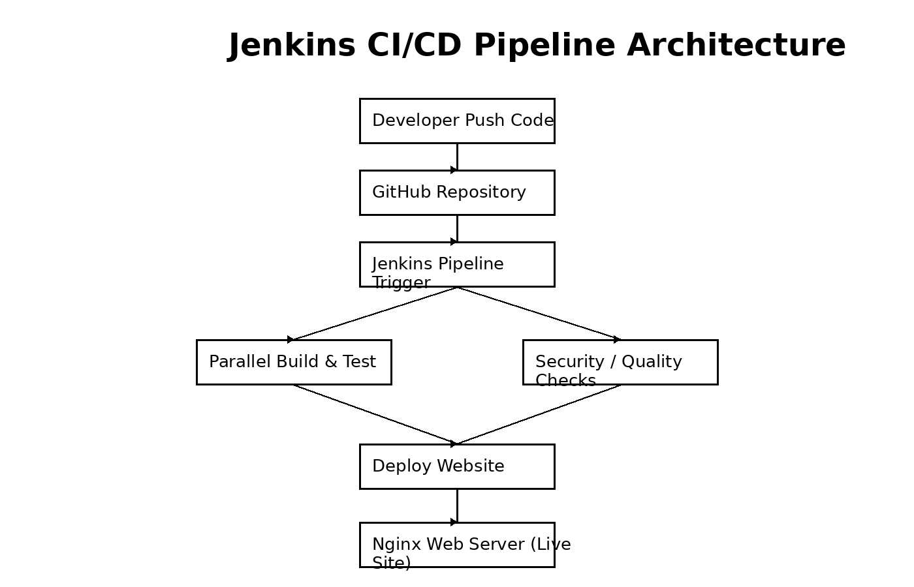

<h1 align="center">🚀 Jenkins Pipeline Examples</h1>

<p align="center">
Declarative Jenkins Pipelines | CI/CD Automation | DevOps Learning Repository
</p>

<p align="center">


</p>

---

# 📌 Repository Overview

This repository contains **real Jenkins Declarative Pipeline examples** demonstrating common CI/CD automation patterns used by DevOps engineers.

The goal of this project is to help learners understand:

✔ Jenkins Pipeline syntax  
✔ CI/CD workflow automation  
✔ Parallel vs sequential pipeline execution  
✔ Job orchestration  
✔ Deployment automation

---

# 🧰 Tech Stack

| Tool | Purpose |
|-----|------|
| Jenkins | CI/CD Automation |
| Groovy | Pipeline scripting |
| Linux | Server environment |
| Nginx | Website hosting |

---

# 📂 Repository Structure

```
jenkins-pipeline-examples
│
├── parallel-pipeline
│   └── Jenkinsfile
│
├── parallel-sequential-pipeline
│   └── Jenkinsfile
│
├── job-trigger-pipeline
│   └── Jenkinsfile
│
├── workspace-pipeline
│   └── Jenkinsfile
│
├── website-deployment-pipeline
│   └── Jenkinsfile
│
└── README.md
```

---

# ⚙️ Jenkins Pipeline Examples

## 1️⃣ Parallel Pipeline

Runs multiple stages simultaneously to reduce pipeline runtime.

```groovy
stage('Parallel Execution') {
    parallel {
        stage('Build') {
            steps { echo "Building Application" }
        }
        stage('Test') {
            steps { echo "Running Tests" }
        }
    }
}
```

---

## 2️⃣ Job Trigger Pipeline

Triggers another Jenkins job from a pipeline.

```groovy
build 'child-job-name'
```

---

## 3️⃣ Custom Workspace Pipeline

Runs Jenkins pipeline inside a custom directory.

```groovy
agent {
    node {
        customWorkspace '/data/jenkins/workspace'
    }
}
```

---

# 🏗️ CI/CD Pipeline Architecture



Pipeline Flow:

Developer → GitHub → Jenkins Trigger → Build & Test → Deploy → Live Website

---

# 🎬 DevOps CI/CD Animation

Example CI/CD workflow animation:


---

# 🚀 How to Run

Clone repository

```
git clone https://github.com/sutar-rushikesh/jenkins-pipeline-examples.git
```

Create a Jenkins Pipeline Job

1. Open Jenkins
2. Click **New Item**
3. Select **Pipeline**
4. Choose **Pipeline Script from SCM**
5. Add this repository URL
6. Run pipeline

---

# 📚 Learning Outcomes

✔ Jenkins Declarative Pipeline syntax  
✔ CI/CD pipeline automation  
✔ Pipeline parallel execution  
✔ Jenkins job orchestration  
✔ Basic deployment automation

---
# 📚 Jenkins Dashboard
<p align="center">

</p>
sample-code-parallel
<p align="center">


</p>
sample-code-parallel+Sequential
<p align="center">


</p>
Parallel + Sequential together
<p align="center">


</p>

simple-website-hosting-pipeline
<p align="center">


</p>


# 👨‍💻 Author

**Rushikesh Sutar**

DevOps Engineer | AWS | Kubernetes | Terraform | CI/CD

---

⭐ If this repository helped you, consider giving it a star!
